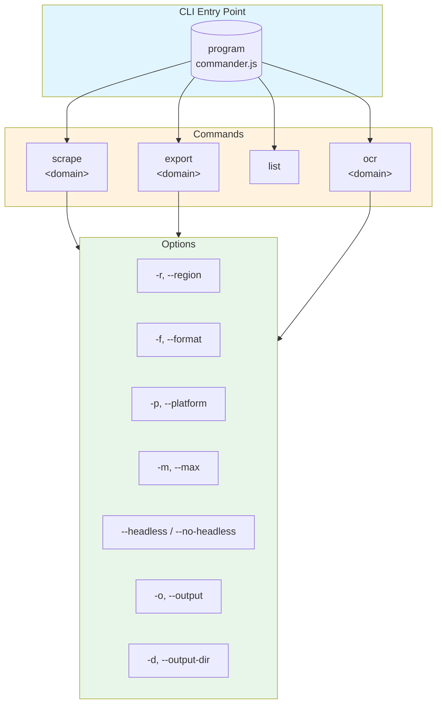

# CLI Commands - System Overview

```mermaid
flowchart TB
    subgraph CLI["CLI Entry Point"]
        direction TB
        program[("program<br/>commander.js")]
    end

    subgraph Commands["Commands"]
        scrape_cmd["scrape<br/>&lt;domain&gt;"]
        export_cmd["export<br/>&lt;domain&gt;"]
        list_cmd["list"]
        ocr_cmd["ocr<br/>&lt;domain&gt;"]
    end

    subgraph Options["Options"]
        opt_region["-r, --region"]
        opt_format["-f, --format"]
        opt_platform["-p, --platform"]
        opt_max["-m, --max"]
        opt_headless["--headless / --no-headless"]
        opt_output["-o, --output"]
        opt_output_dir["-d, --output-dir"]
    end

    program --> scrape_cmd
    program --> export_cmd
    program --> list_cmd
    program --> ocr_cmd

    scrape_cmd --> Options
    export_cmd --> Options
    ocr_cmd --> Options

    style CLI fill:#e1f5fe
    style Commands fill:#fff3e0
    style Options fill:#e8f5e9
```

## Source Files

- `src/index.ts` - CLI entry point using commander.js

