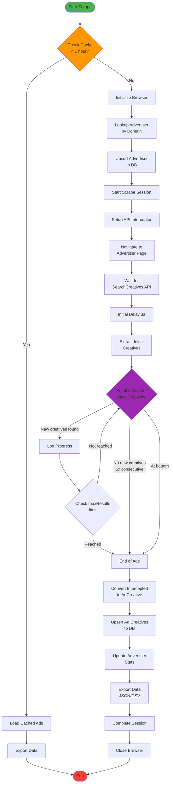

# Scrape Command Workflow

## Source Files

- `src/commands/scrape.ts` - Main scrape command orchestration
- `src/database/repository.ts` - Database operations (upsert, session tracking)
- `src/export/index.ts` - Export entry points

