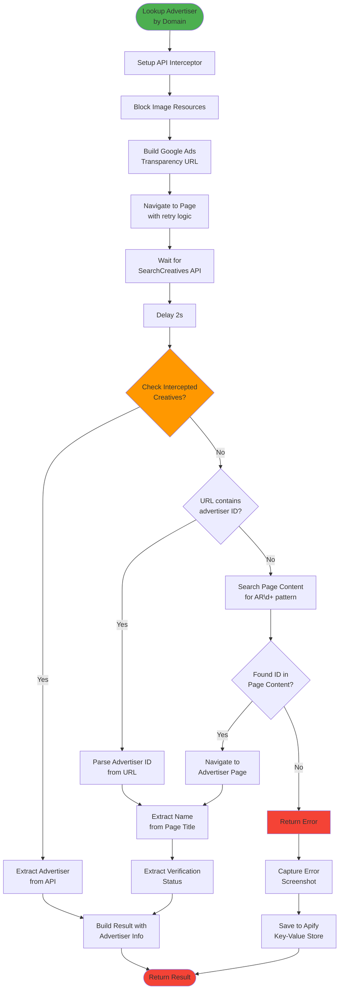

# Advertiser Lookup Process

```mermaid
flowchart TB
    Start([Lookup Advertiser<br/>by Domain]) --> SetupInt[Setup API Interceptor]
    SetupInt --> BlockImages[Block Image Resources]
    BlockImages --> BuildURL[Build Google Ads<br/>Transparency URL]
    BuildURL --> NavigatePage[Navigate to Page<br/>with retry logic]

    NavigatePage --> WaitAPI[Wait for<br/>SearchCreatives API]
    WaitAPI --> Delay1[Delay 2s]
    Delay1 --> CheckCreatives{Check Intercepted<br/>Creatives?}

    CheckCreatives -->|Yes| ExtractAdv[Extract Advertiser<br/>from API]
    ExtractAdv --> BuildResult[Build Result with<br/>Advertiser Info]
    BuildResult --> End([Return Result])

    CheckCreatives -->|No| CheckURL{URL contains<br/>advertiser ID?}

    CheckURL -->|Yes| ParseURL[Parse Advertiser ID<br/>from URL]
    ParseURL --> ExtractName[Extract Name<br/>from Page Title]
    ExtractName --> ExtractStatus[Extract Verification<br/>Status]
    ExtractStatus --> BuildResult

    CheckURL -->|No| SearchPage[Search Page Content<br/>for AR\d+ pattern]
    SearchPage --> FoundID{Found ID in<br/>Page Content?}

    FoundID -->|Yes| NavigateAdv[Navigate to<br/>Advertiser Page]
    NavigateAdv --> ExtractName
    FoundID -->|No| ReturnError[Return Error]

    ReturnError --> CaptureError[Capture Error<br/>Screenshot]
    CaptureError --> SaveToApify[Save to Apify<br/>Key-Value Store]
    SaveToApify --> End

    style Start fill:#4caf50
    style End fill:#f44336
    style CheckCreatives fill:#ff9800
    style ReturnError fill:#f44336
```

## Source Files

- `src/scraper/advertiser.ts` - Advertiser lookup by domain

