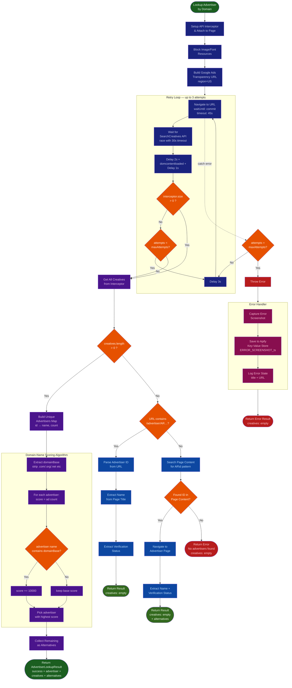

# Advertiser Lookup Process

```mermaid
flowchart TB
    Start([Lookup Advertiser<br/>by Domain]) --> SetupInt[Setup API Interceptor<br/>& Attach to Page]
    SetupInt --> BlockRes[Block Image/Font<br/>Resources]
    BlockRes --> BuildURL[Build Google Ads<br/>Transparency URL<br/>region=US]

    BuildURL --> RetryLoop

    subgraph RetryLoop [Retry Loop — up to 3 attempts]
        direction TB
        Attempt[Navigate to URL<br/>waitUntil: commit<br/>timeout: 45s] --> WaitAPI[Wait for<br/>SearchCreatives API<br/>race with 30s timeout]
        WaitAPI --> Delay1[Delay 2s +<br/>domcontentloaded +<br/>Delay 1s]
        Delay1 --> CheckSize{interceptor.size<br/>&gt; 0 ?}
        CheckSize -->|No| CheckAttempts{attempts &lt;<br/>maxAttempts?}
        CheckAttempts -->|Yes| RetryDelay[Delay 3s] --> Attempt
    end

    CheckSize -->|Yes| GetCreatives[Get All Creatives<br/>from Interceptor]
    CheckAttempts -->|No| GetCreatives

    GetCreatives --> HasCreatives{creatives.length<br/>&gt; 0 ?}

    HasCreatives -->|Yes| BuildMap[Build Unique<br/>Advertisers Map<br/>id → name, count]

    subgraph Scoring [Domain-Name Scoring Algorithm]
        direction TB
        DomainBase[Extract domainBase<br/>strip .com/.org/.net etc] --> ScoreLoop[For each advertiser:<br/>score = ad count]
        ScoreLoop --> NameMatch{advertiser name<br/>contains domainBase?}
        NameMatch -->|Yes| Boost[score += 10000]
        NameMatch -->|No| KeepScore[keep base score]
        Boost --> PickBest[Pick advertiser<br/>with highest score]
        KeepScore --> PickBest
    end

    BuildMap --> DomainBase
    PickBest --> CollectAlts[Collect Remaining<br/>as Alternatives]
    CollectAlts --> ReturnSuccess([Return AdvertiserLookupResult<br/>success + advertiser +<br/>creatives + alternatives])

    HasCreatives -->|No| CheckURL{URL contains<br/>/advertiser/AR…?}

    CheckURL -->|Yes| ParseURL[Parse Advertiser ID<br/>from URL]
    ParseURL --> ExtractName[Extract Name<br/>from Page Title]
    ExtractName --> ExtractStatus[Extract Verification<br/>Status]
    ExtractStatus --> ReturnFallback([Return Result<br/>creatives: empty])

    CheckURL -->|No| SearchPage[Search Page Content<br/>for AR\d pattern]
    SearchPage --> FoundID{Found ID in<br/>Page Content?}

    FoundID -->|Yes| NavigateAdv[Navigate to<br/>Advertiser Page]
    NavigateAdv --> ExtractName2[Extract Name +<br/>Verification Status]
    ExtractName2 --> ReturnFallback2([Return Result<br/>creatives: empty<br/>+ alternatives])

    FoundID -->|No| ReturnError([Return Error<br/>No advertisers found<br/>creatives: empty])

    Attempt -. catch error .-> CatchNav{attempts =<br/>maxAttempts?}
    CatchNav -->|No| RetryDelay
    CatchNav -->|Yes| ThrowError[Throw Error]

    ThrowError --> ErrorHandler
    subgraph ErrorHandler [Error Handler]
        direction TB
        CaptureScreenshot[Capture Error<br/>Screenshot] --> SaveKVS[Save to Apify<br/>Key-Value Store<br/>ERROR_SCREENSHOT_ts]
        SaveKVS --> LogState[Log Error State<br/>title + URL]
    end
    ErrorHandler --> ReturnErrorFinal([Return Error Result<br/>creatives: empty])

    style Start fill:#1b5e20,color:#e8f5e9
    style ReturnSuccess fill:#1b5e20,color:#e8f5e9
    style ReturnFallback fill:#33691e,color:#f1f8e9
    style ReturnFallback2 fill:#33691e,color:#f1f8e9
    style ReturnError fill:#b71c1c,color:#ffcdd2
    style ReturnErrorFinal fill:#b71c1c,color:#ffcdd2
    style ThrowError fill:#b71c1c,color:#ffcdd2
    style CheckSize fill:#e65100,color:#fff3e0
    style HasCreatives fill:#e65100,color:#fff3e0
    style CheckURL fill:#e65100,color:#fff3e0
    style FoundID fill:#e65100,color:#fff3e0
    style CheckAttempts fill:#e65100,color:#fff3e0
    style CatchNav fill:#e65100,color:#fff3e0
    style NameMatch fill:#e65100,color:#fff3e0
    style SetupInt fill:#1a237e,color:#c5cae9
    style BlockRes fill:#1a237e,color:#c5cae9
    style BuildURL fill:#1a237e,color:#c5cae9
    style Attempt fill:#1a237e,color:#c5cae9
    style WaitAPI fill:#1a237e,color:#c5cae9
    style Delay1 fill:#1a237e,color:#c5cae9
    style RetryDelay fill:#1a237e,color:#c5cae9
    style GetCreatives fill:#4a148c,color:#e1bee7
    style BuildMap fill:#4a148c,color:#e1bee7
    style DomainBase fill:#4a148c,color:#e1bee7
    style ScoreLoop fill:#4a148c,color:#e1bee7
    style Boost fill:#4a148c,color:#e1bee7
    style KeepScore fill:#4a148c,color:#e1bee7
    style PickBest fill:#4a148c,color:#e1bee7
    style CollectAlts fill:#4a148c,color:#e1bee7
    style ParseURL fill:#0d47a1,color:#bbdefb
    style ExtractName fill:#0d47a1,color:#bbdefb
    style ExtractStatus fill:#0d47a1,color:#bbdefb
    style SearchPage fill:#0d47a1,color:#bbdefb
    style NavigateAdv fill:#0d47a1,color:#bbdefb
    style ExtractName2 fill:#0d47a1,color:#bbdefb
    style CaptureScreenshot fill:#880e4f,color:#f8bbd0
    style SaveKVS fill:#880e4f,color:#f8bbd0
    style LogState fill:#880e4f,color:#f8bbd0
```

## Source Files

- `src/scraper/advertiser.ts` - Advertiser lookup by domain
- `src/scraper/api-interceptor.ts` - API interceptor for SearchCreatives responses
