# Ad Scraping Process

```mermaid
flowchart TB
    Start([scrapeAdvertiserAds]) --> CheckPre{"preInterceptedCreatives<br/>provided?"}

    %% Pre-intercepted branch
    CheckPre -->|Yes| CheckEnough{"preIntercepted.length<br/>>= maxResults?"}
    CheckEnough -->|Yes| SkipNav["Use pre-intercepted creatives<br/>(skip navigation)"]
    CheckEnough -->|No| FetchMore["fetchCreativesViaNavigation()"]
    FetchMore --> Merge["Merge & deduplicate<br/>by creativeId"]

    %% No pre-intercepted branch
    CheckPre -->|No| FullFetch["fetchCreativesViaNavigation()"]

    SkipNav --> Trim
    Merge --> Trim
    FullFetch --> Trim

    %% Trim before OCR
    Trim["Trim to maxResults<br/>BEFORE processing"] --> ConvertAds["convertInterceptedAds()"]

    %% --- fetchCreativesViaNavigation detail ---
    subgraph NavSub ["fetchCreativesViaNavigation()"]
        direction TB
        SetupInt["Setup ApiInterceptor<br/>& attach to page"] --> BuildURL["Build URL with<br/>filters & region"]
        BuildURL --> BlockRes["Block image/CSS/font<br/>resources"]
        BlockRes --> Navigate["Navigate to<br/>advertiser page"]
        Navigate --> WaitAPI["Wait for<br/>SearchCreatives API"]
        WaitAPI --> Delay1["Delay 3s +<br/>networkidle + 1s"]
        Delay1 --> ExtractCount["Extract total ad count<br/>from page text"]
        ExtractCount --> ScrollLoop{"Scroll loop"}
        ScrollLoop --> ScrollDown["Scroll down 800px<br/>+ delay 1.5s"]
        ScrollDown --> CheckNew{"New intercepts?"}
        CheckNew -->|Yes| CheckMax{"interceptor.size<br/>>= maxResults?"}
        CheckMax -->|No| ScrollLoop
        CheckMax -->|Yes| FinishScroll["Finish scrolling"]
        CheckNew -->|No| IncNoNew["Increment<br/>noNewCount"]
        IncNoNew --> CheckNoNew{"noNewCount >= 5?"}
        CheckNoNew -->|Yes| FinishScroll
        CheckNoNew -->|No| CheckBottom{"At bottom<br/>of page?"}
        CheckBottom -->|No| ScrollLoop
        CheckBottom -->|Yes| DelayBottom["Delay 2s"]
        DelayBottom --> CheckGrew{"Height increased?"}
        CheckGrew -->|Yes| ScrollLoop
        CheckGrew -->|No| FinishScroll
        FinishScroll --> ReturnCreatives["Return creatives<br/>+ totalCount"]
    end

    %% --- convertInterceptedAds detail ---
    subgraph ConvertSub ["convertInterceptedAds()"]
        direction TB
        CheckExtract{"extractHeadlines<br/>enabled?"}
        CheckExtract -->|No| BuildAds
        CheckExtract -->|Yes| EachCreative{"For each creative"}
        EachCreative --> IsImage{"Has imageUrl?"}
        IsImage -->|Yes| OCR["recognizeImageText()<br/>via Tesseract OCR"]
        OCR --> CleanOCR["cleanOcrText()<br/>Remove browser chrome noise"]
        CleanOCR --> StoreResult["Store in ocrResults map"]
        IsImage -->|No| HasPreview{"Has textPreviewUrl?"}
        HasPreview -->|Yes| RenderPreview["extractTextFromPreviewUrl()<br/>Render in browser page"]
        RenderPreview --> ParseFrames["Parse iframe text<br/>Filter noise/JS/boilerplate"]
        ParseFrames --> StoreResult
        HasPreview -->|No| EachCreative
        StoreResult --> EachCreative
        EachCreative -->|Done| TermWorker["terminateWorker()"]
        TermWorker --> BuildAds["Build AdCreative[]<br/>with OCR results"]
    end

    ConvertAds --> ReturnResult["Return AdScrapeResult<br/>{success, ads, totalFound}"]

    %% --- Detail page fallback (extractFromDetailPage) ---
    subgraph DetailFallback ["extractFromDetailPage() — fallback"]
        direction TB
        OpenDetail["Open new page<br/>Navigate to detail URL"] --> WaitSettle["Wait for DOM +<br/>networkidle + scroll"]
        WaitSettle --> ScanFrames["Scan all frames"]
        ScanFrames --> FilterNoise["Filter CSS/JS/boilerplate<br/>noise from frame text"]
        FilterNoise --> PickBest["Pick best headline +<br/>description"]
    end

    %% Styles - dark fills with light text
    style Start fill:#2e7d32,color:#ffffff
    style CheckPre fill:#1565c0,color:#ffffff
    style CheckEnough fill:#1565c0,color:#ffffff
    style SkipNav fill:#2e7d32,color:#ffffff
    style FetchMore fill:#5e35b1,color:#ffffff
    style Merge fill:#5e35b1,color:#ffffff
    style FullFetch fill:#5e35b1,color:#ffffff
    style Trim fill:#c62828,color:#ffffff
    style ConvertAds fill:#e65100,color:#ffffff
    style ReturnResult fill:#2e7d32,color:#ffffff

    style SetupInt fill:#4527a0,color:#ffffff
    style BuildURL fill:#4527a0,color:#ffffff
    style BlockRes fill:#4527a0,color:#ffffff
    style Navigate fill:#4527a0,color:#ffffff
    style WaitAPI fill:#4527a0,color:#ffffff
    style Delay1 fill:#4527a0,color:#ffffff
    style ExtractCount fill:#4527a0,color:#ffffff
    style ScrollLoop fill:#6a1b9a,color:#ffffff
    style ScrollDown fill:#6a1b9a,color:#ffffff
    style CheckNew fill:#6a1b9a,color:#ffffff
    style CheckMax fill:#6a1b9a,color:#ffffff
    style IncNoNew fill:#6a1b9a,color:#ffffff
    style CheckNoNew fill:#6a1b9a,color:#ffffff
    style CheckBottom fill:#6a1b9a,color:#ffffff
    style DelayBottom fill:#6a1b9a,color:#ffffff
    style CheckGrew fill:#6a1b9a,color:#ffffff
    style FinishScroll fill:#6a1b9a,color:#ffffff
    style ReturnCreatives fill:#4527a0,color:#ffffff

    style CheckExtract fill:#e65100,color:#ffffff
    style EachCreative fill:#bf360c,color:#ffffff
    style IsImage fill:#bf360c,color:#ffffff
    style OCR fill:#bf360c,color:#ffffff
    style CleanOCR fill:#bf360c,color:#ffffff
    style HasPreview fill:#bf360c,color:#ffffff
    style RenderPreview fill:#bf360c,color:#ffffff
    style ParseFrames fill:#bf360c,color:#ffffff
    style StoreResult fill:#bf360c,color:#ffffff
    style TermWorker fill:#bf360c,color:#ffffff
    style BuildAds fill:#e65100,color:#ffffff

    style OpenDetail fill:#37474f,color:#ffffff
    style WaitSettle fill:#37474f,color:#ffffff
    style ScanFrames fill:#37474f,color:#ffffff
    style FilterNoise fill:#37474f,color:#ffffff
    style PickBest fill:#37474f,color:#ffffff
```

## Source Files

- `src/scraper/ads.ts` - Main ad scraping logic with `scrapeAdvertiserAds()`, `fetchCreativesViaNavigation()`, `convertInterceptedAds()`
- `src/scraper/api-interceptor.ts` - `ApiInterceptor` class and `InterceptedCreative` type
- `src/ocr/tesseract.ts` - `recognizeImageText()` for OCR on image ads, `terminateWorker()`

## Key Behaviors

1. **Pre-intercepted creatives** — If `preInterceptedCreatives` are passed and satisfy `maxResults`, navigation is skipped entirely
2. **Merge & dedup** — When pre-intercepted creatives exist but are insufficient, new creatives are fetched and merged by `creativeId`
3. **Trim before OCR** — Creatives are sliced to `maxResults` *before* expensive OCR/preview processing
4. **Image ads → OCR** — `recognizeImageText()` + `cleanOcrText()` strips browser chrome noise (favicon artifacts, "Sponsored" labels, URL bars)
5. **Text ads → Preview rendering** — `extractTextFromPreviewUrl()` renders the JS preview in a browser page and parses iframe content
6. **Detail page fallback** — `extractFromDetailPage()` navigates to the ad detail URL and scans iframes; used as a fallback, not the primary method
