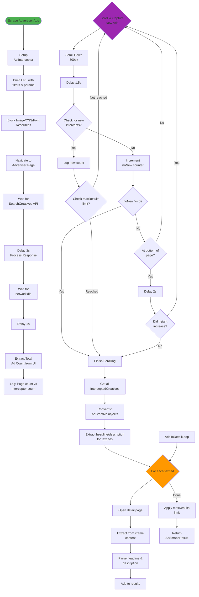

# Ad Scraping Process

```mermaid
flowchart TB
    Start([Scrape Advertiser Ads]) --> SetupInterceptor["Setup<br/>ApiInterceptor"]
    SetupInterceptor --> BuildURL[Build URL with<br/>filters & params]
    BuildURL --> BlockResources[Block Image/CSS/Font<br/>Resources]
    BlockResources --> Navigate["Navigate to<br/>Advertiser Page"]

    Navigate --> WaitAPI["Wait for<br/>SearchCreatives API"]
    WaitAPI --> Delay1["Delay 3s<br/>Process Response"]
    Delay1 --> WaitNetwork["Wait for<br/>networkidle"]
    WaitNetwork --> Delay2["Delay 1s"]

    Delay2 --> ExtractCount[Extract Total<br/>Ad Count from UI]
    ExtractCount --> LogStats["Log: Page count vs<br/>Interceptor count"]

    ScrollLoop{Scroll & Capture<br/>New Ads} --> ScrollDown[Scroll Down<br/>800px]
    ScrollDown --> DelayScroll[Delay 1.5s]
    DelayScroll --> CheckNew{Check for new<br/>intercepts?}

    CheckNew -->|Yes| LogNew["Log new count"]
    LogNew --> CheckMax{Check maxResults<br/>limit?}
    CheckMax -->|Not reached| ScrollLoop

    CheckNew -->|No| IncrementNoNew[Increment<br/>noNew counter]
    IncrementNoNew --> CheckNoNew{noNew >= 5?}
    CheckNoNew -->|Yes| FinishScroll[Finish Scrolling]
    CheckNoNew -->|No| CheckBottom{At bottom of<br/>page?}

    CheckMax -->|Reached| FinishScroll
    CheckBottom -->|Yes| DelayBottom[Delay 2s]
    CheckBottom -->|No| ScrollLoop
    DelayBottom --> CheckGrew{Did height<br/>increase?}
    CheckGrew -->|Yes| ScrollLoop
    CheckGrew -->|No| FinishScroll

    FinishScroll --> GetCreatives[Get all<br/>InterceptedCreatives]
    GetCreatives --> ConvertFormat[Convert to<br/>AdCreative objects]
    ConvertFormat --> ExtractText[Extract headline/description<br/>for text ads]

    ExtractText --> DetailLoop{For each text ad}
    DetailLoop --> OpenDetail[Open detail page]
    OpenDetail --> ExtractIframe[Extract from iframe<br/>content]
    ExtractIframe --> ParseText[Parse headline &<br/>description]
    ParseText --> AddToResults[Add to results]
    AddToDetailLoop --> DetailLoop

    DetailLoop -->|Done| ApplyMax[Apply maxResults<br/>limit]
    ApplyMax --> ReturnResult[Return<br/>AdScrapeResult]

    style Start fill:#4caf50
    style ScrollLoop fill:#9c27b0
    style DetailLoop fill:#ff9800
```

## Source Files

- `src/scraper/ads.ts` - Main ad scraping logic
- `src/scraper/parser.ts` - Ad detail parsing (used for text ad extraction)

