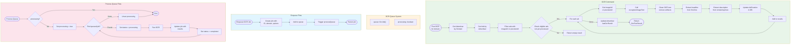

# OCR Processing

```mermaid
flowchart TB
    subgraph OCR_Command["OCR Command"]
        Start([Run OCR<br/>for domain]) --> GetAdv[Get Advertiser<br/>by Domain]
        GetAdv --> GetAds[Get Ads by<br/>Advertiser]
        GetAds --> FilterAds[Filter ads with<br/>imageUrl or previewUrl]
        FilterAds --> CheckEligible{Check eligible ads<br/>not yet processed}

        CheckEligible -->|Yes| ProcessLoop[For each ad]
        CheckEligible -->|No| ReturnEmpty[Return empty result]

        ProcessLoop --> GetImage[Get imageUrl<br/>or previewUrl]
        GetImage --> Tesseract[Call<br/>recognizeImageText]
        
        Tesseract --> CleanText[Clean OCR text<br/>remove artifacts]
        CleanText --> ParseHeadline[Extract headline<br/>from first line]
        ParseHeadline --> ParseDesc[Extract description<br/>from remaining lines]
        ParseDesc --> UpdateDB[Update AdCreative<br/>in DB]
        UpdateDB --> AddResult[Add to results]
        AddResult --> ProcessLoop

        ProcessLoop -->|Done| UpdateAdv[Update Advertiser<br/>lastOcrRunAt]
        UpdateAdv --> ReturnResult([Return<br/>OcrRunResult])
    end

    subgraph OCR_Queue["OCR Queue System"]
        direction TB
        queue["queue: OcrJob[]"]
        processing["processing: boolean"
      ]
    end

    subgraph Enqueue_Process["Enqueue Flow"]
        Enqueue([Enqueue OCR Job]) --> Create[Create job with<br/>ID, domain, options]
        Create --> AddQueue[Add to queue]
        AddQueue --> Trigger[Trigger processQueue]
        Trigger --> Return([Return job])
    end

    subgraph Queue_Process["Process Queue Flow"]
        Process([Process Queue]) --> CheckProcessing{processing?}
        CheckProcessing -->|Yes| Exit
        CheckProcessing -->|No| SetProcessing[Set processing = true]
        SetProcessing --> FindJob{Find queued job?}
        
        FindJob -->|Found| SetStatus[Set status = processing]
        SetStatus --> RunOCR[Run OCR]
        RunOCR --> UpdateJob[Update job with<br/>results]
        UpdateJob --> SetComplete[Set status = completed]
        SetComplete --> FindJob

        FindJob -->|None| Unset[Unset processing]
        Unset --> Exit([Exit])
    end

    style OCR_Command fill:#e8f5e9
    style OCR_Queue fill:#fff3e0
    style Enqueue_Process fill:#e1f5fe
    style Queue_Process fill:#fce4ec
```

## Source Files

- `src/commands/ocr.ts` - OCR command handler
- `src/ocr/queue.ts` - OCR job queue system
- `src/ocr/tesseract.ts` - Tesseract.js text recognition

