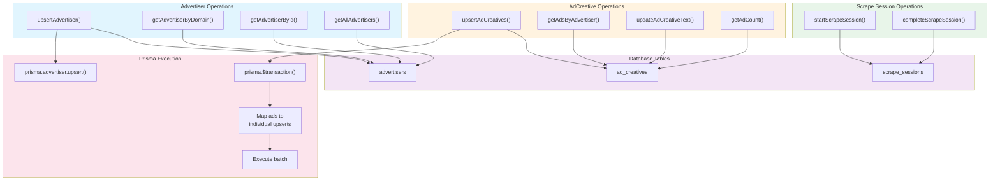

# Database Repository Operations

## Source Files

- `src/database/repository.ts` - All database operations
- `src/database/prisma.ts` - Prisma client setup
- `src/database/schema.ts` - Database schema definitions

