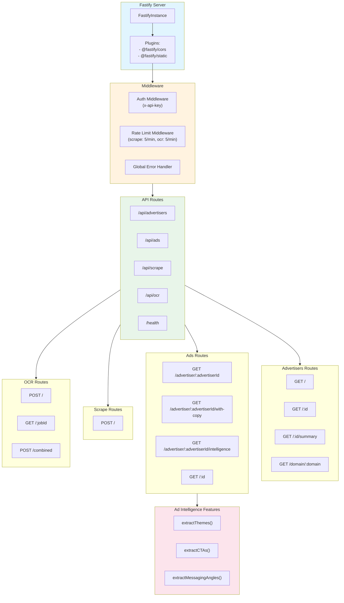

# API Server Architecture

## Source Files

- `src/api/server.ts` - Fastify server setup
- `src/api/routes/scrape.ts` - Scrape API routes
- `src/api/routes/ads.ts` - Ads API routes (including intelligence)
- `src/api/routes/ocr.ts` - OCR API routes
- `src/api/routes/advertisers.ts` - Advertisers API routes
- `src/api/middleware/auth.ts` - Authentication middleware
- `src/api/middleware/rateLimit.ts` - Rate limiting middleware

