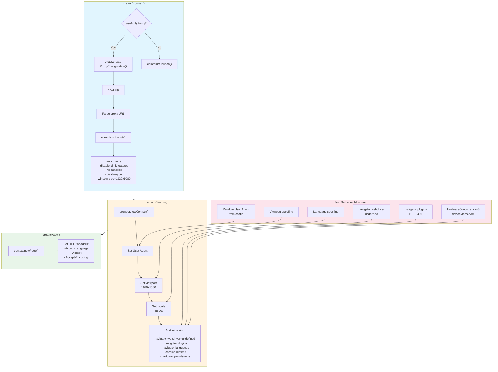

# Browser Automation

```mermaid
flowchart TB
    subgraph CreateBrowser["createBrowser()"]
        direction TB
        CheckProxy{"useApifyProxy?"}
        CheckProxy -->|Yes| ApifyProxy["Actor.create<br/>ProxyConfiguration()"]
        ApifyProxy --> GetUrl["newUrl()"]
        GetUrl --> Parse["Parse proxy URL"]
        Parse --> Launch["chromium.launch()"]
        
        CheckProxy -->|No| LaunchDirect["chromium.launch()"]
        
        Launch --> Args["Launch args:<br/>- disable-blink-features<br/>- no-sandbox<br/>- disable-gpu<br/>- window-size=1920x1080"]
    end

    subgraph CreateContext["createContext()"]
        direction TB
        NewContext["browser.newContext()"]
        NewContext --> UA["Set User Agent"]
        UA --> Viewport["Set viewport<br/>1920x1080"]
        Viewport --> Locale["Set locale<br/>en-US"]
        Locale --> InitScript["Add init script:<br/>- navigator.webdriver=undefined<br/>- navigator.plugins<br/>- navigator.languages<br/>- chrome.runtime<br/>- navigator.permissions"]
    end

    subgraph CreatePage["createPage()"]
        NewPage["context.newPage()"]
        NewPage --> Headers["Set HTTP headers:<br/>- Accept-Language<br/>- Accept<br/>- Accept-Encoding"]
    end

    subgraph AntiDetection["Anti-Detection Measures"]
        RandomUA["Random User Agent<br/>from config"]
        ViewportSpoof["Viewport spoofing"]
        LanguageSpoof["Language spoofing"]
        WebdriverSpoof["navigator.webdriver<br/>undefined"]
        PluginSpoof["navigator.plugins<br/>[1,2,3,4,5]"]
        HardwareSpoof["hardwareConcurrency=8<br/>deviceMemory=8"]
    end

    CreateBrowser --> CreateContext
    CreateContext --> CreatePage
    RandomUA --> UA
    ViewportSpoof --> Viewport
    LanguageSpoof --> Locale
    WebdriverSpoof --> InitScript
    PluginSpoof --> InitScript
    HardwareSpoof --> InitScript

    style CreateBrowser fill:#e1f5fe
    style CreateContext fill:#fff3e0
    style CreatePage fill:#e8f5e9
    style AntiDetection fill:#fce4ec
```

## Source Files

- `src/scraper/browser.ts` - Browser, context, and page creation
- `src/config.ts` - User agents and configuration

