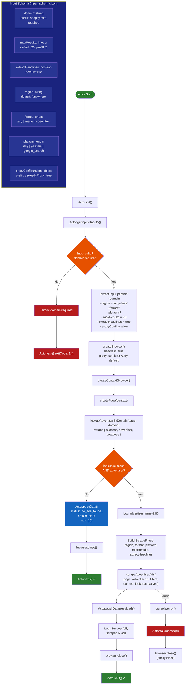

# Apify Actor

```mermaid
flowchart TB
    Start([Actor Start]) --> Init["Actor.init()"]
    Init --> Input["Actor.getInput&lt;Input&gt;()"]
    Input --> Validate{Input valid?<br/>domain required}

    Validate -->|No| InputError["Throw: domain required"]
    InputError --> Exit1["Actor.exit({ exitCode: 1 })"]

    Validate -->|Yes| Extract["Extract input params:<br/>- domain<br/>- region = 'anywhere'<br/>- format?<br/>- platform?<br/>- maxResults = 20<br/>- extractHeadlines = true<br/>- proxyConfiguration"]

    Extract --> CreateBrowser["createBrowser()<br/>headless: true<br/>proxy: config or Apify default"]
    CreateBrowser --> CreateContext["createContext(browser)"]
    CreateContext --> CreatePage["createPage(context)"]

    CreatePage --> Lookup["lookupAdvertiserByDomain(page, domain)<br/>returns { success, advertiser, creatives }"]
    Lookup --> Found{lookup.success<br/>AND advertiser?}

    Found -->|No| NoAds["Actor.pushData({<br/>  status: 'no_ads_found',<br/>  adsCount: 0,<br/>  ads: [] })"]
    NoAds --> Close1["browser.close()"]
    Close1 --> ExitClean["Actor.exit() ✓"]

    Found -->|Yes| LogAdv["Log advertiser name & ID"]
    LogAdv --> BuildFilters["Build ScrapeFilters:<br/>region, format, platform,<br/>maxResults, extractHeadlines"]
    BuildFilters --> Scrape["scrapeAdvertiserAds(<br/>  page, advertiserId, filters,<br/>  context, lookup.creatives)"]

    Scrape --> PushData["Actor.pushData(result.ads)"]
    PushData --> LogSuccess["Log: Successfully<br/>scraped N ads"]
    LogSuccess --> Close2["browser.close()"]
    Close2 --> ExitSuccess["Actor.exit() ✓"]

    Scrape -.->|error| CatchErr["console.error()"]
    CatchErr --> Fail["Actor.fail(message)"]
    Fail --> Close3["browser.close()<br/>(finally block)"]

    subgraph Input_Schema["Input Schema (input_schema.json)"]
        IS_domain["domain: string<br/>prefill: 'shopify.com'<br/>required"]
        IS_maxResults["maxResults: integer<br/>default: 20, prefill: 5"]
        IS_extractHeadlines["extractHeadlines: boolean<br/>default: true"]
        IS_region["region: string<br/>default: 'anywhere'"]
        IS_format["format: enum<br/>any | image | video | text"]
        IS_platform["platform: enum<br/>any | youtube | google_search"]
        IS_proxy["proxyConfiguration: object<br/>prefill: useApifyProxy: true"]
    end

    style Start fill:#2e7d32,color:#fff
    style Found fill:#e65100,color:#fff
    style Validate fill:#e65100,color:#fff
    style NoAds fill:#1565c0,color:#fff
    style ExitClean fill:#2e7d32,color:#fff
    style ExitSuccess fill:#2e7d32,color:#fff
    style Exit1 fill:#b71c1c,color:#fff
    style Fail fill:#b71c1c,color:#fff
    style InputError fill:#b71c1c,color:#fff
    style Input_Schema fill:#1a237e,color:#e8eaf6
    style IS_domain fill:#283593,color:#e8eaf6
    style IS_maxResults fill:#283593,color:#e8eaf6
    style IS_extractHeadlines fill:#283593,color:#e8eaf6
    style IS_region fill:#283593,color:#e8eaf6
    style IS_format fill:#283593,color:#e8eaf6
    style IS_platform fill:#283593,color:#e8eaf6
    style IS_proxy fill:#283593,color:#e8eaf6
```

## Source Files

- `src/actor.ts` - Apify Actor entry point
- `.actor/input_schema.json` - Actor input schema with prefills
