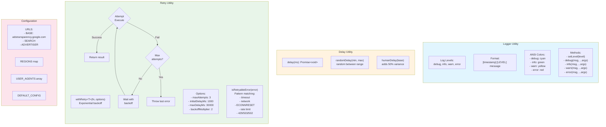

# Utilities

## Source Files

- `src/utils/logger.ts` - Logging utility
- `src/utils/delay.ts` - Delay/promise utilities
- `src/utils/retry.ts` - Retry logic with exponential backoff
- `src/config.ts` - Configuration constants (URLs, regions, user agents)

